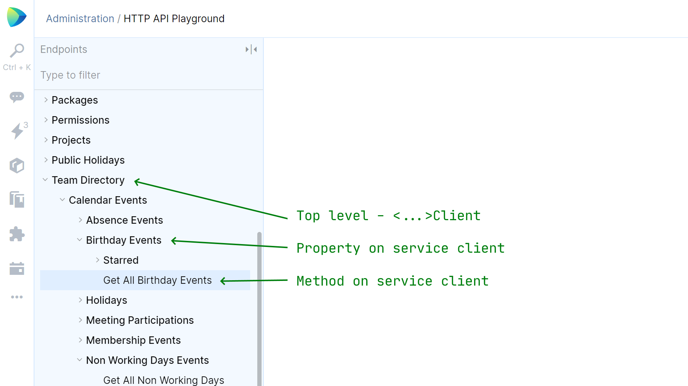
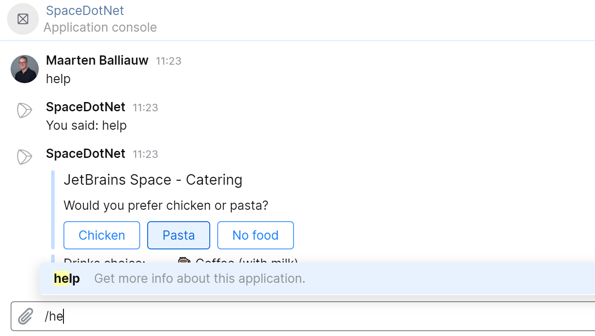
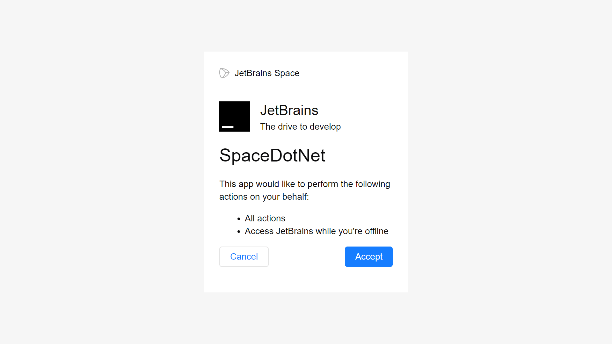
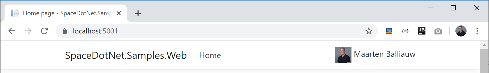
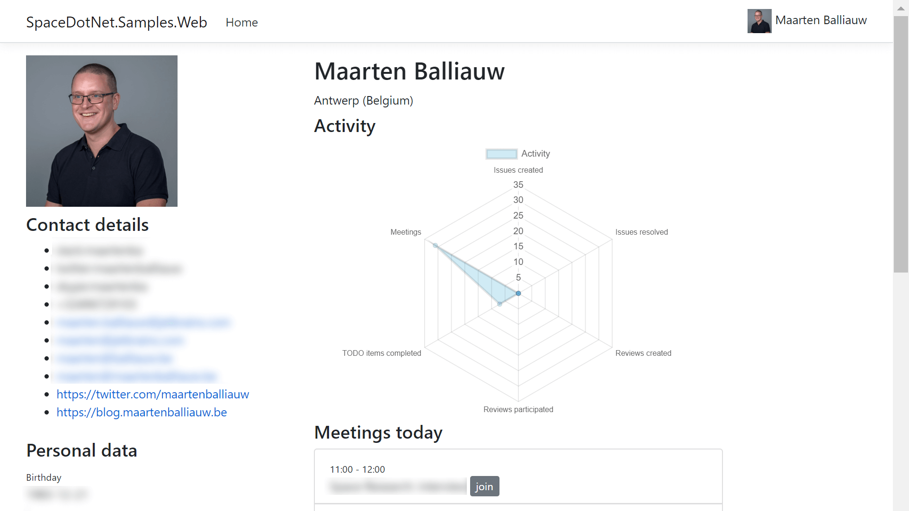

# JetBrains.Space 

The .NET SDK for JetBrains Space is a .NET library to work with the [JetBrains Space](https://jetbrains.com/space/) API. 

> **Disclaimer:** This is a beta version of the .NET SDK for JetBrains Space. It relies on the Space API, which is still in beta and subject to change. By using the current beta .NET SDK for JetBrains Space, you expressly acknowledge that this version of the beta .NET SDK for JetBrains Space may not be reliable, may not work as intended, and may contain errors. Any use of this beta .NET SDK for JetBrains Space is at your own risk.

## Overview

JetBrains.Space consists of several NuGet packages that can be used to integrate with [JetBrains Space](https://jetbrains.com/space/).

Typically, `JetBrains.Space.Client` will be used to work with the Space API. It can be installed using any NuGet client, or the `dotnet` command line tool:

```
dotnet add package JetBrains.Space.Client --version 1.0.0-beta.*
```

Other (optional) packages are available. These can be installed to satisfy additional integration requirements.

* `JetBrains.Space.Client` — The generated client code to work with the Space API.
* `JetBrains.Space.AspNetCore` — Helpers for using JetBrains.Space with ASP.NET Core, such as:
  * An extension method for `IServiceCollection` to register all JetBrains.Space clients as ASP.NET Core services
  * Helpers for Space Applications webhooks (experimental)
  * Space attachment proxy for images and files in a Space organization (experimental)
* `JetBrains.Space.AspNetCore.Authentication` — Authentication provider that integrates with ASP.NET Core.

Let's have a look at how we can start working with `JetBrains.Space.Client`.

## Getting Started

We will need to [register an application](https://www.jetbrains.com/help/space/applications.html) to work with the Space API.  There are various application types, all supporting different authentication flows.

For this example, we will use a *Client application*. Make sure to enable the *Client Credentials Flow* in your application's *Authentication* settings.

### Create a Connection

After installing `JetBrains.Space.Client` in our project, we can use the *Client ID* and *Client Secret* of our Space application to create a `ClientCredentialsConnection` against our Space organization:

```csharp
var connection = new ClientCredentialsConnection(
    organizationUrl,    // i.e. "https://<organization>.jetbrains.space/"
    clientId,           // from settings/secrets
    clientSecret,       // from settings/secrets
    new HttpClient());
```

We can then use the `connection` to instantiate API clients for the endpoints we want to access.

> **Note:** Applications have access to a limited set of APIs when using the [Client Credentials Flow](https://www.jetbrains.com/help/space/client-credentials.html). Many actions (such as posting an article draft) require user consent, and cannot be performed with client credentials. For actions that should be performed on behalf of the user, use other authorization flows, such as [Resource Owner Password Credentials Flow](https://www.jetbrains.com/help/space/resource-owner-password-credentials.html).

### Create a Service Client

Clients for endpoints are mapped to the top level of endpoints we can find in the [HTTP API Playground](https://www.jetbrains.com/help/space/api.html#api-playground):



As an example, the top level *Team Directory* has a client class named `TeamDirectoryClient`, with methods that correspond to endpoints seen in the HTTP API Playground.

```csharp
var teamDirectoryClient = new TeamDirectoryClient(connection);
```

> **Tip:** While not required to work with JetBrains.Space, having the [HTTP API Playground](https://www.jetbrains.com/help/space/api.html#api-playground) open will be useful to explore the available APIs and data types while developing.

### Get Profile by Username 

Let's fetch a user profile from the Team Directory:

```csharp
var memberProfile = await teamDirectoryClient.Profiles
    .GetProfileAsync(ProfileIdentifier.Username("Heather.Stewart"));
```

The `memberProfile` will expose top level properties, such as `Id`, `Username`, `About`, and more.

To retrieve nested properties, check [nested properties](#nested-properties).

## JetBrains.Space.Client

The `JetBrains.Space.Client` package provides necessary types to connect to and interact with the Space API.

### Authentication and Connection

Communication with Space is handled by the `Connection` base class. A connection keeps track of the Space organization URL, and registers the required JSON serializers that are used under the hood.

`Connection` has several implementations that can be used to authenticate and work with Space:

* `ClientCredentialsConnection` — Supports the [Client Credentials Flow](https://www.jetbrains.com/help/space/client-credentials.html). This is typically used by a Space application that acts on behalf of itself.
* `BearerTokenConnection` — Uses a bearer token obtained using [other flows](https://www.jetbrains.com/help/space/oauth-2-0-authorization.html), or a [personal token](https://www.jetbrains.com/help/space/personal-tokens.html). This is typically used by applications that act on behalf of a user.
* `RefreshTokenConnection` — Extends `BearerTokenConnection` and automatically refreshes tokens using the [Refresh Token Flow](https://www.jetbrains.com/help/space/refresh-token.html).

JetBrains.Space does not handle retrieving an access token that can be used with `BearerTokenConnection` or `RefreshTokenConnection`.

> **Tip:** The Space ASP.NET Core authentication provider (in the `JetBrains.Space.AspNetCore.Authentication` package) includes support for the [Implicit Flow](https://www.jetbrains.com/help/space/implicit.html).

#### Scope

Scope is a mechanism in OAuth 2.0 to limit an application's access to a user's account.

On a `Connection` instance, use the `Scope` property to specify the scope required by an application. 

> **Warning:** By default, JetBrains.Space uses the `**` scope, which requests all available scopes. It is recommended to limit the scope to just those permissions that are needed by your application.

Examples of [available scopes](https://www.jetbrains.com/help/space/oauth-2-0-authorization.html) are available in the Space documentation.

### Service Client

Clients for endpoints are mapped to the [top level of endpoints](docs/images/http-api-playground-levels.png) we can find in the [HTTP API Playground](https://www.jetbrains.com/help/space/api.html#api-playground):

As an example, the top level *Team Directory* has a client class named `TeamDirectoryClient`, with methods that correspond to endpoints seen in the HTTP API Playground.

### Properties, Fields and Partials

In this section, we will cover partial requests and shaping response contents.

#### Background

For most requests, we can shape the results we want to retrieve from the API. In the [HTTP API Playground](https://www.jetbrains.com/help/space/api.html#api-playground), we can toggle checkboxes to include/exclude fields from the result.

When we want to retrieve a user's `id` and `about` description, we can set the `$fields` parameter in an API request to `$fields=id,about`. The API response will then only return those fields.

Fields can be primitive values (integers, strings, booleans, ...), and actual types. As an example, a user profile has a `name` field of type `TD_ProfileName`, which in turn has a `firstName` and `lastName` field. To request this hierarchy, we need to query `$fields=name(firstName,lastName)`.

Being able to retrieve just the information our integration requires, helps in reducing payload size, and results in a better integration performance overall.

In JetBrains.Space, we will need to specify the properties we want to retrieve as well. Let's see how this is done.

#### Top-level Properties by Default

By default, JetBrains.Space will retrieve all top level properties from the Space API. For example, retrieving a profile from the team directory will retrieve all top level properties, such as `Id`, `Username`, `About`, and more:

```csharp
var memberProfile = await teamDirectoryClient.Profiles
    .GetProfileAsync(ProfileIdentifier.Username("Heather.Stewart"));
```

A `TDMemberProfile`, which is the type returned by `GetProfileAsync`, also has a `Managers` property. This property is a collection of nested `TDMemberProfile`, and is not retrieved by default.

#### Nested Properties

Nested properties have to be retrieved explicitly. For example, if we want to retrieve the `Managers` for a user profile, including the manager's name, we would have to request these properties by extending the default partial result:

```csharp
var memberProfile = await teamDirectoryClient.Profiles
    .GetProfileAsync(ProfileIdentifier.Username("Heather.Stewart"), _ => _
        .WithAllFieldsWildcard()            // with all top level fields
        .WithManagers(managers => managers  // include managers
            .WithId()                       //   with their Id
            .WithUsername()                 //   and their Username
            .WithName(name => name          //   and their Name
                .WithFirstName()            //     with FirstName
                .WithLastName())));         //     and LastName
```

All of the builder methods (`With...()`) are extension methods, and should be automatically included by the IDE we are using. For example, the extension methods used in the previous example were automatically included by [Rider](https://www.jetbrains.com/rider/):

```csharp
using JetBrains.Space.Client.TDMemberProfilePartialBuilder;
using JetBrains.Space.Client.TDProfileNamePartialBuilder;
```

JetBrains.Space will help with defining properties to include. Let's say we want to retrieve only the `Id` and `Username` properties for a profile:

```csharp
var memberProfile = await teamDirectoryClient.Profiles
    .GetProfileAsync(ProfileIdentifier.Username("Heather.Stewart"), _ => _
        .WithId()
        .WithUsername());
```

When we try to access the `Name` property for this profile, which we did not request, JetBrains.Space will throw a `PropertyNotRequestedException` with additional information.

```csharp
try
{
    // This will fail...
    Console.WriteLine($"Hello, {memberProfile.Name.FirstName}");
}
catch (PropertyNotRequestedException e)
{
    // ...and we'll get a pointer about why it fails:
    // "The property Name was not requested in the partial builder
    //  for TDMemberProfile. Use .WithName() to include it.
    //  Expected full path: Batch`1->WithData()->WithName()"
    Console.WriteLine(e.Message);
}
```

Let's look at some other extension methods for retrieving partial responses.

#### Partial Extension Methods

As demonstrated in the previous section, all builder methods (`With...()`) are extension methods to help build the partial response based on a property name of an object. There are some other instance methods that can be used when building partial responses.

The `WithAllFieldNames...()` methods can help with building partials:

* `WithAllFieldNamesWildcard()` — Adds all fields at the current level (uses the `*` field definition under the hood).
* `WithAllFieldNamesExplicitly()` — Adds all fields at the current level using their full field names.

These methods can be used to including all fields for the entire current level. As an example, let's retrieve all fields of a user profile, and all top level fields of their managers.

```csharp
var memberProfile = await teamDirectoryClient.Profiles
    .GetProfileAsync(ProfileIdentifier.Username("Heather.Stewart"), _ => _
        .WithAllFieldsWildcard()            // with all top level fields
        .WithManagers(managers => managers  // include managers
            .WithAllFieldsWildcard()));     //   with all their top level fields
```

Partials also support adding field names directly, using their field name in the API.

* `AddFieldName("firstName")`
* `AddFieldNames(new[] { "firstName", "lastName" })`

We recommend not to use `AddFieldName()` and `AddFieldNames()` directly. The generated builder methods (`With...()`) help to ensure type safety.

#### Inheritance

The Space API may return polymorphic responses. In other words, there are several API endpoints that return subclasses.

One such example is `ProjectClient.Planing.Issues.GetAllIssuesAsync()`, where the `CreatedBy` property can be a subclass of `CPrincipalDetails`:

* `CAutomationTaskPrincipalDetails` — when the issue was created by an automation task.
* `CBuiltInServicePrincipalDetails` — when the issue was created by Space itself.
* `CExternalServicePrincipalDetails` — when the issue was created by an external service.
* `CUserWithEmailPrincipalDetails` — when the issue was created by a user that has an e-mail address.
* `CUserPrincipalDetails` — when the issue was created by a user.

By default, these instances will only contain properties from the `CPrincipalDetails` base class. To retrieve specific properties of inherited types, we have to use the `.ForInherited<TInherited>()` extension method, and build the partial response for that specific inheritor.

Here's an example retrieving issues from a project. For the `CreatedBy` property, we are defining that the response should contain:

* `CUserPrincipalDetails` with the `User.Id` property.
* `CUserWithEmailPrincipalDetails` with the `Name` and `Email` properties.

```csharp
await foreach (var issue in _projectClient.Planning.Issues.GetAllIssuesAsyncEnumerable(
    ProjectIdentifier.Key("ABC"), IssuesSorting.UPDATED,
    partial: _ => _
        .WithAllFieldsWildcard()
        .WithCreationTime()
        .WithCreatedBy(createdBy => createdBy
            .WithDetails(details => details
                .ForInherited<CUserPrincipalDetails>(principalDetails => principalDetails
                    .WithUser(user => user
                        .WithId()))
                .ForInherited<CUserWithEmailPrincipalDetails>(userDetails => userDetails
                    .WithName()
                    .WithEmail())))
        .WithStatus()))
{
    if (issue.CreatedBy.Details is CUserPrincipalDetails userPrincipal)
    {
        // ... work with CUserPrincipalDetails ...
    }
    if (issue.CreatedBy.Details is CUserWithEmailPrincipalDetails userWithEmailPrincipal)
    {
        // ... work with CUserWithEmailPrincipalDetails ...
    }
}
```

We can cast these types, use `switch` expressions on their type, and more.

### Batch and `IAsyncEnumerable`

Many operations in the Space API return a collection of results. To guarantee performance, these responses will be paginated, and can be retrieved in batches.

A batch contains the data, and may return the total count of items that will be returned after fetching all pages:

```csharp
public class Batch<T>
{
    List<T>? Data { get; }
    string? Next { get; }
    int? TotalCount { get; }

    bool HasNext();
}
```

We have to specify the properties of the `Batch` type to retrieve, and all the fields of the data type we need.

As an example, let's retrieve the current user's To-Do items for this week, skipping the first 10 items, with their `Id`, `Content` and `Status`:

```csharp
var batch = await _todoClient.GetAllTodoItemsAsync(
    from: weekStart,
    partial: _ => _
        .WithData(data => data
            .WithId()
            .WithContent(content => content
                .ForInherited<TodoItemContentMdText>(md => md
                .WithAllFieldsWildcard()))
            .WithStatus())  
        .WithTotalCount()
        .WithNext());

do
{
    foreach (var todo in batch.Data)
    {
        // ...
    }
    
    batch = await _todoClient.GetAllTodoItemsAsync(
        from: weekStart,
        skip: batch.Next,
        partial: _ => _ /* ... */);
}
while (batch.HasNext());
```

The resulting `batch` will contain one page of results. To retrieve more To-Do items, we will have to make additional API calls. This gets cumbersome rather quickly, which is why API endpoints that return a `Batch<T>` also have an overload that supports `IAsyncEnumerable`.

With the `IAsyncEnumerable` overload for these endpoints, we can iterate over items that are returned. The underlying JetBrains.Space implementation will handle pagination and additional API calls for us. The same example as before, using the `IAsyncEnumerable` overload:

```csharp
await foreach (var todo in _todoClient.GetAllTodoItemsAsyncEnumerable(
    from: weekStart,
    partial: _ => _
        .WithId()
        .WithContent(content => content
            .ForInherited<TodoItemContentMdText>(md => md
                .WithAllFieldsWildcard()))
        .WithStatus()))
{
    // ...
}
```

The [`System.Linq.Async`](https://www.nuget.org/packages/System.Linq.Async) NuGet package may assist in using `IAsyncEnumerable`, with utilities like `FirstOrDefaultAsync()` and more.

> **Tip:** To retrieve the total result count, without any other properties, don't use the `IAsyncEnumerable` overload. Instead of iterating over all results, retrieve only the `TotalCount` property for this batch:
>
> ```csharp
> var batch = await _todoClient.GetAllToDoItemsAsync(
>     from: weekStart, partial: _ => _.WithTotalCount());
> var numberOfResults = batch.TotalCount;
> ```
> 
> **Keep in mind that some endpoints do not return the total count as part of tha batch.** For these cases, iterating over results is the only manner to get the total number of results.

### Resource Retry Policies

Transient errors may occur when an application communicates with a Space organization.
For example, a connection error may occur that can be retried, or rate limiting may be in place and the application should lower the frequency of the requests it makes. 
By transparently retrying a failed operation, stability of the application can be improved.

The `BearerTokenConnection` connection (and its implementations) support setting a retry policy using the `ResourceRetryPolicy` property.

In the .NET SDK for JetBrains Space, you can find two retry policies:
* `RateLimitedResourceRetryPolicy` — The default retry policy that retries operations when a rate limit is in place (up to 5 times).
* `NoResourceRetryPolicy` — Can be used to disable retry policies.

> **Tip:** While not generally required, our application can implement its own retry policy based on the `IResourceRetryPolicy` interface.
> 
> Many applications already have retry policies and circuit breakers implemented using open-source libraries such as [Polly](https://github.com/App-vNext/Polly).
> You can use Polly policies such as Retry, Circuit Breaker, Bulkhead Isolation, Timeout, and Fallback, by wrapping it in a `IResourceRetryPolicy` implementation:
> ```csharp
> class PollyRateLimitedResourceRetryPolicy
>     : IResourceRetryPolicy
> {
>     // Setup Polly policy to retry RateLimitedException
>     private readonly AsyncRetryPolicy _policy = Policy
>         .Handle<RateLimitedException>()
>         .WaitAndRetryAsync(5, retryAttempt => TimeSpan.FromSeconds(retryAttempt));
>
>     // Delegate Space retry policy to Polly
>     public Task<TResult> ExecuteAsync<TResult>(
>         Func<Task<TResult>> handler, CancellationToken cancellationToken) 
>         => _policy.ExecuteAsync(async _ => await handler(), cancellationToken);
> }

## JetBrains.Space.AspNetCore

The `JetBrains.Space.AspNetCore` package provides helpers for using JetBrains.Space with ASP.NET Core.

### `IServiceCollection` extension methods

There are extension methods for `IServiceCollection`:

* `AddSpaceConnection()` — Registers a [`Connection`](#authentication-connection) as a service. The registration lifetime is transient by default.
* `AddSpaceClientApi()` — Registers JetBrains.Space [clients](#create-service-client) as transient services. The registration lifetime is transient by default. Note that this method will throw an exception when no `Connection` has been registered.

### Space Applications webhooks (Experimental)

> **Warning:** Application webhooks are under development and are subject to change.

We can build interactive [Space Applications](https://www.jetbrains.com/help/space/applications.html#register-your-client-in-space), that let us extend Space with slash commands and interactive chat messages.

An application webhook handler can be created by extending the `SpaceWebHookHandler` class, and then overriding one or all of its methods to react to certain events:

* `HandleListCommandsAsync` is used to provide details about available slash commands to Space.
* `HandleListMenuExtensionsAsync` is used to provide details about available menu extensions to Space.
* `HandleMessageAsync` is called when a user sends our application a chat message.
* `HandleMessageActionAsync` is called when a user interacts with our application by clicking a button.
* `HandleMenuActionAsync` is called when a user interacts with our application by clicking a menu item on a message.
* `HandleWebhookRequestAsync` is called when a webhook payload is delivered from Space.
* `HandleInitAsync` is called when an application is initialized in the Space Organization. 
* `HandleChangeClientSecretRequestAsync` is called when the application client secret is updated in Space organization.
* `HandleChangeServerUrlAsync` is called when the application server URL is updated.

The `CateringWebHookHandler` class is an example application that implements the above, and provides an interactive means of ordering (virtual) food and beverages.



Once a `SpaceWebHookHandler` is built, it has to be registered in the ASP.NET Core server application. This is a two-step process, which is typically done in our application's `Startup` class. In the `ConfigureServices()` method, we can register our application using the `AddSpaceWebHookHandler<T>()` method:
                                                                                                                                    
```csharp
public void ConfigureServices(IServiceCollection services)
{
    services.AddSpaceWebHookHandler<CateringWebHookHandler>(
        options => Configuration.Bind("Space", options));
}
```

The next step is to add configuration details. In `appsettings.json`, add the `"Space"` section, and make sure to include the `EndpointSigningKey` and `EndpointVerificationToken` settings - the values are available when registering our application in Space:

```json             
{
 "ConnectionStrings": { },
 "Logging": { },
 "AllowedHosts": "*",

 "Space": {
   "EndpointSigningKey": "{endpoint-signing-key}",
   "EndpointVerificationToken": "{endpoint-verification-token}"
 }
}
```

Almost there! We have now registered and configured our Space Application webhook handler, but we still need to expose it on a URL endpoint. In our application's `Startup` class, in the `Configure()` method, we can use the `MapSpaceWebHookHandler<T>()` method:

```csharp
public void Configure(IApplicationBuilder app, IWebHostEnvironment env)
{
    app.UseEndpoints(endpoints =>
    {
        // Space webhook receiver endpoint
        endpoints.MapSpaceWebHookHandler<CateringWebHookHandler>("/space/receive");
    });
}
```

Our application can now be registered in Space using this URL endpoint, for example `https://apps.example.org/space/receive`.

### Space attachment proxy (Experimental)

When building web applications, you may want to include images from your Space organization, such as profile pictures or avatars.

Images (and other attachments) hosted on Space typically require authentication. For security reasons, Space does not allow third-party to use its authentication cookies. In other words: it is impossible for third-party web applications to display images (or other attachments).

To overcome this limitation in a secure manner, you may want to *proxy* these images. When a user is authenticated with your application, your application can then make an authenticated request to Space, and proxy the requested image for the end user.

The .NET SDK for Space comes with an (experimental) attachment proxy that does just that. You can register it in the `Startup` class: in the `Configure()` method, use the `MapSpaceAttachmentProxy()` method:

```csharp
public void Configure(IApplicationBuilder app, IWebHostEnvironment env)
{
    app.UseEndpoints(endpoints =>
    {
        // Attachment proxy endpoint
        endpoints.MapSpaceAttachmentProxy("/space-attachments");
    });
}
```

> **Note:** It is recommended to configure a CORS policy that allows only `GET` requests to this endpoint, from your application.

Next, you can embed images from Space by making use of the attachment proxy URL.

In Space, images (and other attachments) are typically served from the `/d/{identifier}` URL, e.g. `https://{organization}.jetbrains.space/d/{identifier}`. With the Space attachment proxy configured at the `/space-attachments` endpoint path, your application can use the `/space-attachments/{identifier}` URL.

For example, if you use the `JetBrains.Space.AspNetCore.Authentication` package, you can render the current user's small avatar as follows:

```html

```

The `JetBrains.Space.Samples.Web` project contains an example of how to use the attachment proxy.

> **Tip:** Use the (experimental) Space Token Management to have the Space attachment proxy authenticate using your application's current authenticated user.

## JetBrains.Space.AspNetCore.Authentication

The `JetBrains.Space.AspNetCore.Authentication` package contains an authentication provider that integrates with ASP.NET Core. It can be used to authenticate a web application's users with Space, much like [other external authentication providers](https://docs.microsoft.com/en-us/aspnet/core/security/authentication/social/?view=aspnetcore-3.1).

### Registering Space as an Authentication Provider

Registering Space as an authentication provider is typically done in our application's `Startup` class. In the `ConfigureServices()` method, we can extend the existing authentication options by adding Space:

```csharp
public void ConfigureServices(IServiceCollection services)
{
    services.AddAuthentication(options =>
        {
            options.DefaultAuthenticateScheme = CookieAuthenticationDefaults.AuthenticationScheme;
            options.DefaultSignInScheme = CookieAuthenticationDefaults.AuthenticationScheme;            
            options.DefaultChallengeScheme = "Space";
        })
        .AddCookie()
        .AddSpace(options => Configuration.Bind("Space", options))
}
```
          
In the above code sample, we did two things:

* `options.DefaultChallengeScheme = "Space";` — Default to using Space as the default provider to challenge when login is required.
* `.AddSpace(options => Configuration.Bind("Space", options))` — Add Space authentication, and use settings from configuration.

The next step is to add configuration details. In `appsettings.json`, add the `"Space"` section:

```json             
{
 "ConnectionStrings": { },
 "Logging": { },
 "AllowedHosts": "*",

 "Space": {
   "ServerUrl": "https://{organization}.jetbrains.space",
   "ClientId": "{client-id}",
   "ClientSecret": "{client-secret}"
 }
}
```

Optionally, we can further configure Space authentication behavior in our application. There are several options available:

```csharp
.AddSpace(options =>
{
    Configuration.Bind("Space", options);

    options.Scope.Add("**");   // Set scope (defaults to **)
    options.SaveTokens = true; // Save tokens (defaults to true)

    // ...
});
```
 
Once added, our application will now challenge authentication with Space, and request the user to log in and grant access:



When access is granted, the user will be redirected back to our application and will be authenticated. 

### Space Identity and Claims

An identity constructed by Space provides us with several claims and their values. The `SpaceClaimTypes` class provides access to these values:

* `SpaceClaimTypes.UserId` / `urn:space:userid` — The user id.
* `SpaceClaimTypes.UserName` / `urn:space:username` — The username.
* `SpaceClaimTypes.SmallAvatar` / `urn:space:smallAvatar` — The small avatar identifier. Can be used to render a small avatar by appending it to the Space organization URL, e.g. `https://{organization}.jetbrains.space/d/{identifier}`.
* `SpaceClaimTypes.Avatar` / `urn:space:avatar` — The avatar identifier. Can be used to render an avatar  by appending it to the Space organization URL, e.g. `https://{organization}.jetbrains.space/d/{identifier}`.
* `SpaceClaimTypes.ProfilePicture` / `urn:space:profilePicture` — The profile picture identifier. Can be used to render a profile picture  by appending it to the Space organization URL, e.g. `https://{organization}.jetbrains.space/d/{identifier}`.
* `SpaceClaimTypes.FirstName` / `urn:space:firstName` — The user's first name.
* `SpaceClaimTypes.LastName` / `urn:space:lastName` — The user's last name.

These claims and their values are available on identities created by JetBrains.Space. When using multiple authentication providers, it may be required to [enrich our application identity](https://docs.microsoft.com/en-us/aspnet/core/security/authentication/social/additional-claims?view=aspnetcore-3.1).

The `JetBrains.Space.Samples.Web` project in the JetBrains.Space repository uses these claims to render user information in the site header, including the user's full name and profile picture:



Using these identity properties helps personalize our application's experience.

### Space Token Management (Experimental)

Some web applications can be considered a "100% Space integration". For example, we may build an application that lets a user authenticate with Space, and then generates a personalized dashboard with data obtained using the Space API.

The `JetBrains.Space.AspNetCore.Authentication` package contains an experimental feature, token management, to assist with authenticating and making sure the current user's identity is used to access the Space APIs. It also handles refresh tokens, when the current access token has expired.

> **Warning:** The functionality described in this section is experimental. It may not work for every setup, depending on how ASP.NET Authentication is configured.
> The following has to be true to use Space Token Management in an ASP.NET Core application:
>
>  * Space is the only authentication provider used;
>  * ASP.NET Core Identity storage providers are not in use.

Space Token Management has to be configured in the application's `Startup` class, in the `ConfigureServices()` method:

```csharp
public void ConfigureServices(IServiceCollection services)
{
    services.AddAuthentication(options =>
        {
            options.DefaultAuthenticateScheme = CookieAuthenticationDefaults.AuthenticationScheme;
            options.DefaultSignInScheme = CookieAuthenticationDefaults.AuthenticationScheme;
            options.DefaultChallengeScheme = "Space";
        })
        .AddCookie()
        .AddSpace(options => Configuration.Bind("Space", options))
        .AddSpaceTokenManagement(); // auto-refreshes tokens in the background and provides a Space connection

    services.AddSpaceClientApi(); // register Space API clients
}
```

Our web application will now authenticate every user using the Space Authentication Provider.

The `AddSpaceTokenManagement()` call registers Space Token Management, and will inject a `Connection` that is authenticated for the current user of our application. Combined with `AddSpaceClientApi()`, which registers the Space API clients with the current service collection, we can now make use of the Space API throughout our application, and let JetBrains.Space handle all authentication needs.

Have a look at the `JetBrains.Space.Samples.Web` project in the JetBrains.Space repository, which uses this technique to build a personal dashboard:



## Continuous integration builds NuGet feed

The .NET SDK for JetBrains Space is available on [NuGet.org](https://www.nuget.org/).
Continuous integration packages are available on [public.jetbrains.space](https://nuget.pkg.jetbrains.space/public/p/space-api-client/nuget/v3/index.json).

To access continuous integration packages, add a file named `NuGet.config` in the same folder as your solution / `.sln` file, with the following contents:

```xml
<?xml version="1.0" encoding="utf-8"?>
<configuration>
  <packageSources>
    <add key="SpaceDotNet" value="https://nuget.pkg.jetbrains.space/public/p/space/nuget/v3/index.json" protocolVersion="3" />
  </packageSources>
</configuration>
```

## Acknowledgements

The .NET SDK for JetBrains Space uses an [`EnumStringConverter`](https://github.com/JetBrains/space-dotnet-sdk/blob/main/src/JetBrains.Space.Common/Json.Serialization/EnumStringConverter.cs) to (de)serialize JSON strings to C# enumerations. It originates in [Macross Software JSON Extensions](https://github.com/Macross-Software/core/blob/develop/ClassLibraries/Macross.Json.Extensions/README.md) (MIT license).

The token management feature is inspired by the [automatic token management sample in IdentityServer4](https://github.com/IdentityServer/IdentityServer4/tree/master/samples/Clients/src/MvcHybridAutomaticRefresh/AutomaticTokenManagement).